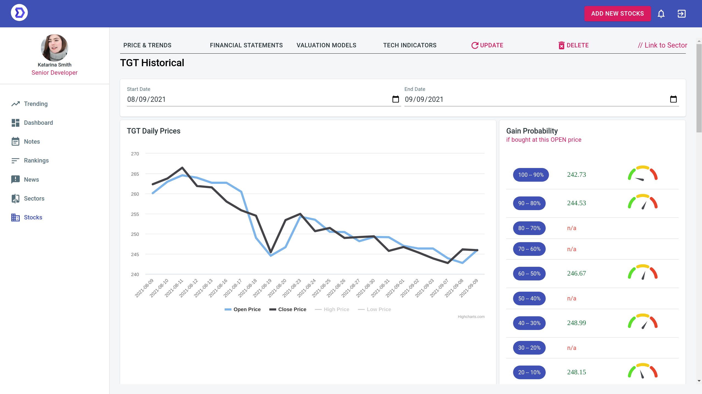

This is a fully containerized **Django+React** web application for
data analysis hobbyist who is interested in the stock market, and uses
the Yahoo!  Finance API data.

It tries to provide analysis that are not readily available from
Google or Yahoo, but are often asked. Especially, we hope the analysis
feels more human friendly than hard numbers. For example, if a stock
drops 5% today, is this a lot? In our analysis, we will give an answer
"Last time I saw a price lower than this was 30 days ago" &mdash; "so
it has lost 30 days worth of ground"... such, we believe, help the
user to feel that data analysis and the market are fun, and
approachable.

# Quick Start

- documentation:
  [https://fengxia41103.github.io/stock/](https://fengxia41103.github.io/stock/)
- dev & deploy: [https://fengxia41103.github.io/stock/dev%20and%20deployment.html](https://fengxia41103.github.io/stock/dev%20and%20deployment.html)
- code:
  [https://github.com/fengxia41103/stock](https://github.com/fengxia41103/stock)

# Credits

Thanks for these tools and their teams whose work made this possible:

- [yahooquery](https://github.com/dpguthrie/yahooquery)
- [create-react-app](https://github.com/facebook/create-react-app)
- [material-ui](https://material-ui.com/)

Last but not the least, I'd like to thank Yahoo! for continuing to
make free stock data available.

# License

This project is licensed under the terms of the MIT license.
