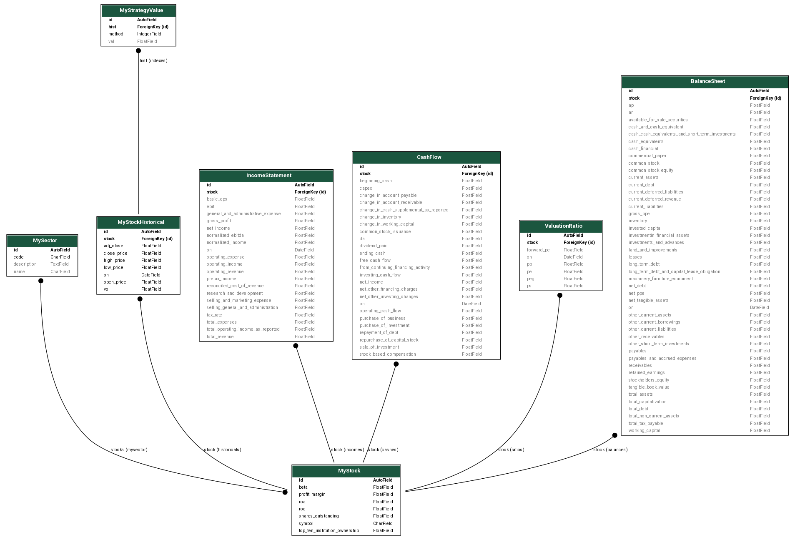

# Backdrop

The app is a complete rewrite of one which I wrote five years
ago. At the time Jookun approached me that he had some wise strategies
of investment. I was intrigued by his passion, but wanted to verify
its worth using some simulation. Thus a Django was created with Yahoo
finance daily data as the input, and some data crunch based on his
idea. Like all other ideas, I started to come up some of my own while
working on it, and gradually it let me deep down into the rabbit hole
&mdash; for the first time in my career, I had computation so intense
that it would overheat my laptop and had it shut down! I felt I was on
track of something. However, it had then been left to rot
since. Though I had tried to revive it over the years, some of the
code was done in such a complex manner that I didn't have the heart to
read it again. One impression, however, always left me with a hope,
the difficulty of obtain these free daily data. As mentioned, I
started with Yahoo data. However, it was shut down just around that
time. Later I shifted to Alpha Advantage while it was still free of
use. Well, not anymore. Soon after I switched to it, I guess it gained
enough popularity that it went on with memberships and so on. What
jumping through these hoops occurred to me that if I could just
publish these historical data somehow, and let people download and use
them, there are already value.

So recently, I started to think about this idea. Starting with another
round of reviving the old app, I implemented Django command to dump DB
data into CSVs, thus creating 500+ files, each representing a SP500
symbol, which were what I had. However, I want more &mdash; how about
a better user experience? how about some computation of probabilities
based on a layman's observation? how about DCF?... all these,
eventually propelled me to rewrite this from scratch, and here it is.

# Audience & goals

First, it is an absolute illusion if a beginner like myself will beat
the market by these analysis, not only because of limitation of
knowledge, information, and experience, but of personality. I don't
know what the winners are like. Internet is filled with articles on
what it takes to be a good investor. I have some of those qualities,
but there is no guarantee nonetheless. Therefore, I'm back to zero.

But one thing I am certain, that everyone will experience what I have
experienced, at some point of his/her life, that they are curious, or
interested in, the stock market, have the itch to try, know some bits
of it, but not a whole lot, and have some basic **hunch** of some
_pattern_, or _frequency_, or _occurance_, and thought there might be
a gold mine buried underneath and yourself might be the lucky one. So,
how to find out, or to verify?

Here are five levels of users I sense:

| Type  | Tool            | Audience                                                |
|-------|-----------------|---------------------------------------------------------|
| 1     | apps & websites | Have basic knowledge, satisfied with reported info      |
| 2     | Excel           | Think they have some data/info analysis edge            |
| **3** | **Excel + VBA** | **Automate routine computation and data assembly**      |
| 4     | Script or lib   | Programmer who gained more computation power over Excel |
| 5     | Commercial      | Professional, sky is the limit, membership              |

Difference between 3 & 4 are blurry, but the idea is that
scripting/lib will give you a much wider selection of tools than
VBA. Further, VBA is not as good a building block if you want to stand
on the shoulder of a giant.

Users of type 1 and type 5 are not my audience. User of type 2,3,4 are
essentially the same people &mdash;

- they are independent/self-confident enough to think of their own
  method, but are yet willing to go with a commercial source or
  solution
- they have some financial knowledge, and
- are not afraid of (or even fond of) data crunching.

Their routine follows these steps &mdash;

1. Obtain raw data:
   1. daily price (well, you could also have finer grain data)
   2. financial reports: balance sheet, income statement, cash flow
   3. computed ratios, eg. P/E, beta
   4. some popular indicator or evaluation values
2. Crunch of his own indicator or measure using these data
3. Draw a graph here and there to visualize his results
4. Search for pattern

During my research and implementation, following this pattern, I found
a few places where this tool can help:

- **Getting data**. represented the first barrier higher than expected. I have
  related my experience w/ Yahoo, Google, Alpha. I'm surprised how
  limited such data sources are there considering how widely spread
  the Internet has become, and stock data being always in the public
  domain.

      A value of this tool is to handle API of available data
      sources so to retrieve available _raw_ data.

- **Cleansing data**. Once you get data, consuming data represents
  another barrier &mdash; understanding particular data form (&larr;
  this is usually source dependent) and handling data anomaly.

      2nd value of this tool is to normalize these data points, and
      potentially amending missing data by providing reasonable default.

- **Computing standard ratios**. Crunching a clean data set is usually not the
  challenge at all.  Of course you can go with your fancy where the
  _edge_ is believed to be. However, there are always a few _standard_
  ratios everyone seems to begin with, eg. growth rate of a number
  from period to period, or pcnt of one expanse of the total, things
  like that. They are not difficult to compute, but rather
  mechanical/tedious, and are not readily available from a data
  source[^1]. Therefore, you have to do them _manually_.

      Therefore, 3rd value of this tool is to provide some computed values
      out of box. One beauty of historical data is that they don't
      change. Therefore, a pre-calculated result is as good as new.

In short, one can view this tool as a fancy automated Excel template
that I have built to facilitate routine works and get you going w/
your analysis quickly less the mechanical build-up that is necessary
but distracting from analysis itself.

# System design

<figure class="col s12 center">
  
  <figcaption>Stock app high level design</figcaption>
</figure>

System is split into backend and fronend. Backend is a Django app w/
exposed REST API using [Tastypie][2]. Frontend is [React][3].

Primary data source is Yahoo's financial data. In particular, I'm pulling these:

- historical stock daily prices &mdash; high, low, open, close, volume
- financial statements &mdash; balance sheet, income statement, and cash flow statement
- published meta &mdash; beta, P/E, and so on. Since these are
  opinionated, Yahoo is just one of many alternatives.

# Data model

Model names are intuitive.

| Name              | Description                                                     |
|-------------------|-----------------------------------------------------------------|
| MyStock           | Place for name, symbol                                          |
| MyStockHistorical | Daily trading data                                              |
| MyStrategyValue   | Pre-computed values based on historical, eg. moving average     |
| IncomeStatement   | As name                                                         |
| BalanceSheet      | As name                                                         |
| CashFlow          | As name                                                         |
| ValuationRatio    | Published valuation ratios, eg. P/E. They are source dependent. |

<figure class="col s12">
  
  <figcaption>Stock app data models</figcaption>
</figure>

# Data persistence & processing

Data persistence is MySql 5.7. Using Django's ORM, this is not a hard requirement if your preference is something else.

Data processing is handled by Redis via Celery so to achieve ease of scale. As mentioned earlier, `MyStrategeValue` are derived from historicals, thus are computed prehand using this mechanism: Django custom command &rarr; compose celery task &rarr; submit task to Redis queue &rarr; task executed and data is persisted to DB.

There are also custom model property which is computed on the
fly. Most of them can be pre-computed also since historicals are not
static. However, to minimize dependency on these values that must be
prepared as a separate step, I opted to the current method. By
observation, performance penalty by not having them in DB is
acceptable.

Using docker, the following data volumes are used:

| Volume     | Attach to            |
|------------|----------------------|
| stock-data | Main DB data storage |
| redis-data | Redis data storage   |

# Network

Network of the setup is fairly simple. We distinguish `data` vs. `management`:

<figure class="col s12 center">
  
  <figcaption>Stock app networks</figcaption>
</figure>

## Ports

A service is a function unit. In this implementation, each is a
docker. I try to limit exposure of ports on docker host so this
application can be easily co-hosted with others without causing port
conflicts. In essence, `8084` is the frontend UI port, and `8003` is
the backend API port. All others are docker-to-docker only.

| Component | Docker Port | Service                             | Host Map |
|-----------|-------------|-------------------------------------|----------|
| Frontend  | 80          | Main frontend app w/ Nginx built-in | 8084     |
| Backend   | 80          | Nginx proxy                         | 8003     |
| Backend   | 3306        | MySql DB                            | none     |
| Backend   | 8001        | Django app                          | none     |
| Backend   | 6379        | Redis                               | none     |

# Develop & Deployment

Assuming you have `docker` and `docker-compose` installed already, clone the [repo][1], and under `/backend` and `/frontend`, use the `docker-compose up --build` for the first run to build initial images, and `docker-compose up -d` for incremental changes.

Frontend development can be benefited by a non-docker setup. So you need to `npm install` then `yarn run start`, which serves on `localhost:3000`. Once you are satisfied w/ your frontend code, production deployment can be `docker-compose up --build -d`, which serves on `<your ip>:8084`.

[1]: http://github.com/fengxia41103/stock
[2]: https://django-tastypie.readthedocs.io/en/latest/
[3]: https://reactjs.org/
[4]: https://yahooquery.dpguthrie.com/
[5]: https://github.com/fengxia41103/stock

[^1]: Some source provide indicators such as MACD. Most, however, only
    provide raw/reported data such as sales of an Income Statement. My
    goal, therefore, is to follow the conventional train of thought by
    converting these values into percentage, and some period-to-period
    change rate, and so on, which I found myself doing a lot whenever
    I receive an Excel full of numbers.
