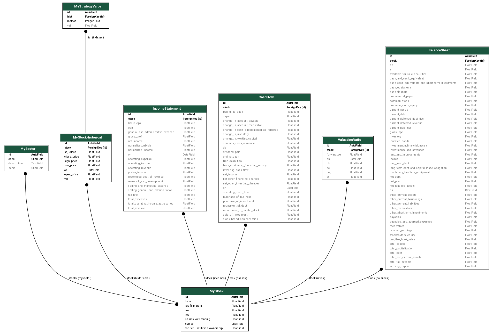

Title: Stock App Design
Date: 2021-09-09 17:38
Slug: stock app design
Author: Feng Xia
Modified: 2021-09-21 17:00

## Disclaimer, philosophy

<figure class="col l7 m6 s12">
    
</figure>

First of all, this isn't a magic tool to beat the market. We firmly
believe the final conclusion should be drawn by the user whose brain
power holds the edge over the market, if ever.

The purpose of this tool is to assemble information in a fashion to
assist the user process these information more efficiently by
liberating his/her from tedious, but necessary, steps such as data
collection, ratio computation, drawing a line graph, etc., than
without such a helper. Thus with this tool, the user could focus onto
creating value instead of being bogged down by less value-added works.

## Audience & goals

This application is written for users who have interest in the
stock market, in particular, data analysis of the stock data. In my
experience, there are five levels of users:

| Type  | Tool            | Audience                                                |
|-------|-----------------|---------------------------------------------------------|
| 1     | apps & websites | Have basic knowledge, satisfied with reported info      |
| 2     | Excel           | Think they have some data/info analysis edge            |
| **3** | **Excel + VBA** | **Automate routine computation and data assembly**      |
| **4**     | Script or lib   | Programmer who gained more computation power over Excel |
| 5     | Commercial      | Professional, sky is the limit, membership              |

A common pattern/workflow these users follow:

1. Obtain raw data: 
   1. daily price (well, you could also have finer grain data)
   2. financial reports: balance sheet, income statement, cash flow
   3. computed ratios, eg. P/E, beta
   4. some popular indicator or evaluation values
2. Crunch of his own indicator or measure using these data
3. Draw a graph here and there to visualize his results
4. Search for pattern, signal, clue...

## Challenges & Values

It's always easier said than done. If you echo the work pattern listed
above, you would also recognize the challenges, thus the values this
tool is hoping to create.

### Getting data

Surprisingly it is rather difficult to find a free data source for
stock data. For this tool, we have opted to use the [Yahoo! finance
API][1], and in particular, the [yahooquery][7] library, as the data
source. If you have access to other data, the tool can be easily
extended by [TBD: write plugin]();

> A value of this tool is to handle API of available data
> sources so to retrieve available _raw_ data.
>

### Cleansing data

Data quality is the next challenge. By establishing a solid data model
in the backend, the tool takes care of cleansing and normalizing the
data before serving them for consumption. Headaches such as missing
data points, divided by zero exception are handled as much as
possible by the tool.

> 2nd value of this tool is to normalize these data points, and
> potentially amending missing data by providing reasonable default.
>

### Computation of ratios, percentages

In stock analysis, straight-off-the-SEC-report data, such as a sales
figure, is less interesting than comparisons. For example, it's less
useful to know that AMZN's last reported sales was 68B than to know
that the sales grew or shrank by 8%[^2] over this period. Further, one
can now see other questions to ask, such as whether the `8%` is lower
or higher than AMZN's average, or its peer's... and so on.

Further, any financial book or blog has a long list of **ratios**
calculated from reported values, and many of these ratios are not
readily available by just looking at Yahoo! or Google. Therefore, they
often require the user to do the computation themselves.

In this tool, we have included many of the ratios, percentages, and
side-by-side comparisons so to ease the pain.

> Therefore, 3rd value of this tool is to provide some computed values
> out of box. One beauty of historical data is that they don't
> change. Therefore, a pre-calculated result is as good as new.
>

### RESTful ready

The backend readily serves a RESTful API. Thus it is ready to
integrate with another toolchain of your choice. We strive to provided
a good user experience w/ our frontend implementation. However, we
also anticipate that needs vary.

See the [API doc][] for details.

## System design

<figure class="col s12 center">
  
  <figcaption>Stock app high level design</figcaption>
</figure>

System is split into backend and fronend. Backend is a Django app w/
exposed REST API using [Tastypie][2]. Frontend is [React][3].

Primary data source is Yahoo's financial data. In particular, I'm pulling these:

- historical stock daily prices &mdash; high, low, open, close, volume
- financial statements &mdash; balance sheet, income statement, and cash flow statement
- published meta &mdash; beta, P/E, and so on. Since these are
  opinionated, Yahoo is just one of many alternatives.

## Data model

Model names are intuitive.

| Name              | Description                                                     |
|-------------------|-----------------------------------------------------------------|
| MyStock           | Place for name, symbol                                          |
| MyStockHistorical | Daily trading data                                              |
| MyStrategyValue   | Pre-computed values based on historical, eg. moving average     |
| IncomeStatement   | As name                                                         |
| BalanceSheet      | As name                                                         |
| CashFlow          | As name                                                         |
| ValuationRatio    | Published valuation ratios, eg. P/E. They are source dependent. |

<figure class="col s12">
  
  <figcaption>Stock app data models</figcaption>
</figure>

## Data persistence & processing

Data persistence is MySql 5.7. Using Django's ORM, this is not a hard
requirement if your preference is something else.

Data processing is handled by Redis via Celery so to achieve ease of
scale. As mentioned earlier, `MyStrategeValue` are derived from
historicals, thus are computed prehand using this mechanism: Django
custom command &rarr; compose celery task &rarr; submit task to Redis
queue &rarr; task executed and data is persisted to DB.

There are also custom model property which is computed on the
fly. Most of them can be pre-computed also since historicals are
essentially static after a day. However, to minimize dependency on
these values that must be prepared as a separate step, we opted to the
current method. By observation, performance penalty by not having them
in DB is acceptable.

Using docker, the following data volumes are used:

| Volume     | Attach to            |
|------------|----------------------|
| stock-data | Main DB data storage |
| redis-data | Redis data storage   |

## Develop & Deployment

See [dev & deployment][6] for details.

[1]: https://finance.yahoo.com/quotes/API,Documentation/view/v1/
[2]: https://django-tastypie.readthedocs.io/en/latest/
[3]: https://reactjs.org/
[4]: https://yahooquery.dpguthrie.com/
[5]: https://github.com/fengxia41103/stock
[6]: {filename}/dev%20and%20deployment.md
[7]: https://github.com/dpguthrie/yahooquery/

[^1]: Some source provide indicators such as MACD. Most, however, only
    provide raw/reported data such as sales of an Income Statement. My
    goal, therefore, is to follow the conventional train of thought by
    converting these values into percentage, and some period-to-period
    change rate, and so on, which I found myself doing a lot whenever
    I receive an Excel full of numbers.

[^2]: This is a made up example for illustration purpose.
