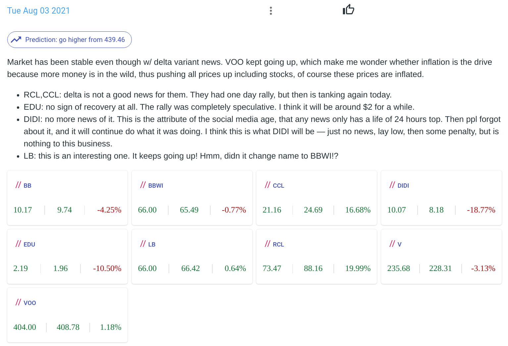

Title: Notes
Date: 2021-09-23 16:23
Slug: notes
Author: Feng Xia

One thing we find useful for beginners is study note. The experience
of researching a stock is not different from your class &mdash; you
take notes, jog down your thoughts, review them, and learn from
mistakes.

Rather than keeping your notes outside the system, our **Notes**
function is for you to keep your thoughts close to where the data is.

## Create a new note

Creating a new note is easy. We provided a powerful Markdown editor
that has rich features.

<figure class="col s12">
    <figcaption>Creating a new note</figcaption>
    
</figure>

Once a note is created, one can also _edit_ it or _delete_ it if needed.

### Types of notes

There are two types of notes: one of general purpose, and one of a
specific stock. The two are nearly identical in all aspects except the
latter is created from a stock's detail page, thus having a clear
association w/ a stock at creation, while the other is created from
the Notes list page, thus having no special dedication to a stock.

There is no limitation on contents for either stock. The distinction
only becomes important when you use the _Preduction_ function (see next).

### Prediction

<figure class="col s12">
    <figcaption>Make a prediction</figcaption>
    
</figure>

The **Prediction** is a feedback loop to help user hone in his
judgment and understanding of his material. When writing a note, user
is **required** to make a prediction for the _stock_ this note is
linked with. For general purpose note, the prediction is applied to a
S&P500 INDEX[^1], thus you can view it as a _prediction of the general
market_. For stock specific note, the prediction is for that stock
only.

There are only two options: up, or down. Default is UP.

## Review notes

Reviewing note is the best way to recall what the market was like
then, what was on my mind, and how well my understand/prediction
panned out comparing to the real market.

<figure class="col s12">
    <figcaption>A sample note</figcaption>
    
</figure>

### Stock tracker

All symbols in the notes would be picked up automatically and
tracked. Each symbol has three data, from left to right:

1. `close` price on the date the note was created
2. latest `close` price
3. return % between these two price points

<figure class="col s12">
    <figcaption>Notes stock tracker</figcaption>
    
</figure>

Taking CCL in the picture as example, its price was at $21.16 on
8/3/201, the day this note was created. Now its latest price is at
$24.69, representing a 16.68% gain from 8/3. Therefore, you can use
this to review what you wrote and thought about CCL on 8/3, and see
how well you have judged its performance.

### Prediction checking

Use the creation timestamp, the tool will indicate the price point the
prediction was made against. A **thumb up** or **down** would then
indicate whether the current price makes the prediction true or false.

<figure class="col s12">
    <figcaption>Notes prediction checking</figcaption>
    
</figure>

In this example, the price point was at $439.46 on 8/3, and our
prediction was that it would go up, and it did!

[^1]: We are using VOO by default. This is subject to change to SPY or
    equivalent in the future.
