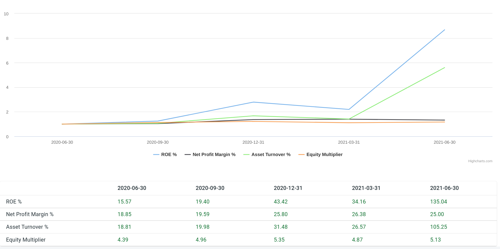
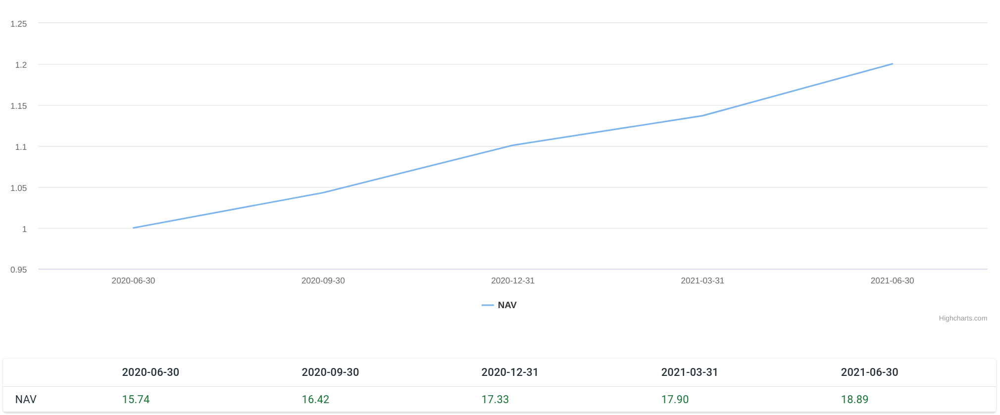

Title: Stock Valuation Models
Date: 2021-09-22 20:13
Slug: stock valuation models
Author: Feng Xia

We offer analysis of four valuation methods: DuPont ROE model,
discounted cash flow model, valuation ratios such as P/E, P/B, and net
asset value.

## DuPont ROE

[DuPont ROE model][1] is "a useful technique used to decompose the
different drivers of return on equity (ROE)". In a nutshell it breaks
down a single ROE value into three components:

1. **net profit margin %**: Some businesses are by nature high profit
   margin but small volume, such as a luxury brand, while others are
   the opposite, eg. WalMart. Thus a trend of this aspect shows
   whether the business is performing as expected, or has shifted its
   strategy.
2. **asset turn over %**: Wholesale business such as WalMart often
   rely on thin margin but large volume, thus shows a high asset turn
   over rate.
3. **equity multiplier**: In other words, debt leverage over
   equity. Borrowing power is a magnifier, and it works both ways.

Yahoo! API provides a latest ROE value. However, our tool take this
one step further by computing the ROE value of each reporting
period. By doing so the tool also shows how the ROE value and its DuPont
factors change over time. Thus the user gets a sense how the business
is growing or deteriorating.

<figure class="col s12">
    <figcaption>Stock ROE DuPont Model</figcaption>
    
</figure>

In the example, AAPL's ROE (blue) jumped based on the 3/31/2021
reporting data. DuPont model shows that its profit margin and debt
leverage didn't change much, and the drive of this jump was mainly by
an increase of asset turnover rate (green). Further, if we examine the
net profit margin vs. the debt leverage, we would see that the debt
leverage was growing from 1 to 1.2, while the net profit margin grew
even quicker from `1` to `1.3`. Now to think of it, if AAPL had a
higher margin, an explosive volume, and not taking on much debt, I
would say its business is in a good shape by this valuation.

<figure class="col s12">
    <figcaption>Example DuPont Model: net profit vs. debt leverage</figcaption>
    
</figure>

## Discounted Cash Flow (DCF)

[DCF model][2] is a fairly complex one. There are many assumptions
involved, each could have throw off the estimation significantly into
insensible land. Here we are not to offer a better DCF number. Rather,
it is to give user the power to tweak and test these assumptions and
see their effect on the estimation, thus allowing user to test his
methods as well as honing his understanding w/ quick feedbacks.

Another thing worth noting is many of the DCF templates/tools on the
web use _average_ to smooth out sales or cash flow and so forth, and
usually provides a single DCF value in the end. Ours, instead,
computes per each reporting period using its **reported data
only**. Due to the data quality of our data source, some stocks may
have a missing data point in a reporting period. In this case, we look
back for the closest reporting period that can provide this value and
use that. All these would introduce distortion to the
estimation. However, as a modeling tool, we think the benefit of being
able to see the estimation changes over time outweighs the tradeoffs.

<figure class="col s12">
    <figcaption>Stock DCF assumptions</figcaption>
    
</figure>

1. **risk free rate**: Default `1.242%`. However, one should look up
   the published [Treasury Rates][3] for an up-to-date value.
2. **project years**: Default `5`, meaning we are projecting its sales
   for these many years. There is also an underline assumption that
   the business would exist for this long.
3. **growth rate**: Projected free cash flow growth rate per
   year. Default to `7%`.
4.  **terminal growth rate**: Default to `1%`. The DCF model is
    sensitive to this value.
5.  **market premium**: Default to `7%`.
6.  **cost of debt**: Default to `10%`.

Changing any of these assumptions would refresh both the chart and
table w/ newly computed values. As our practice, the chart is drawn w/
data normalized, thus showing both their relative strength to each
other, and a trend over time.

<figure class="col s12">
    <figcaption>Stock DCF chart</figcaption>
    
</figure>

<figure class="col s12">
    <figcaption>Stock DCF table</figcaption>
    
</figure>

In the table, we list all the values used in this valuation, thus
allowing user to further verify and investigate, for example, for
outlier values based on his own judgment or knowledge. Most of the
values are self-explanatory. A few are discussed below:

| Value                          | Description                             |
|--------------------------------|-----------------------------------------|
| Last Close Price               | The `close` price on the reporting date |
| Discounted Cash Flow Valuation | Estimated DCF price                     |
| Valuation/Price Ratio          | `DCF price / last close price`          |
| Cost of Equity                 | `risk free + (beta * market premium)`   |

We assume a constant `cost of equity`. This is obviously
inadequate. However, since we do not yet allow changing risk free
rate, beta and market premium per reporting period, this value is used
in all periods' estimation. This will be improved in future releases.

The `valuation/price ratio` is meant to show how well the DCF
estimation was compared to the actual market. A value greater than 1
means DCF was more optimistic than the market, and a value less than 1
is the opposite. Therefore, by testing different assumptions, the tool
provides a **feedback loop**to the user how likely his assumptions
were approximating the actuality. Market may not be always right. But
it's being very wrong is rare, also.

## Valuation Ratios

These valuation ratios are published by the data source. Thus, here
the tool simply present them as reported.

<figure class="col s12">
    <figcaption>Stock Valuation Ratios</figcaption>
    
</figure>

## Net Asset Value (NAV)

These values are published by the data source.

<figure class="col s12">
    <figcaption>Stock NAV model</figcaption>
    
</figure>

[1]: https://www.investopedia.com/terms/d/dupontanalysis.asp
[2]: https://www.investopedia.com/terms/d/dcf.asp
[3]: https://www.treasury.gov/resource-center/data-chart-center/interest-rates/pages/textview.aspx?data=yield

[^1]: These values are **normalized** as 1 being the base.
