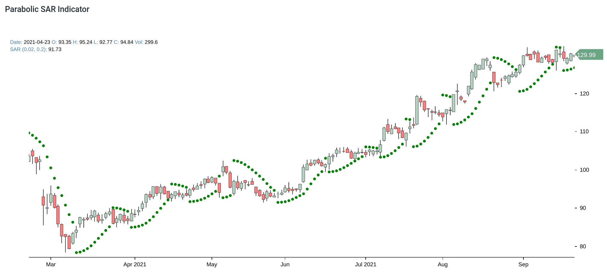
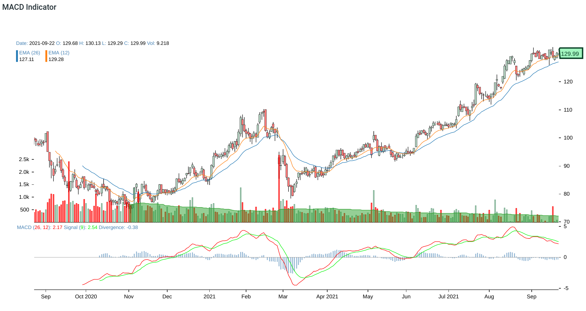
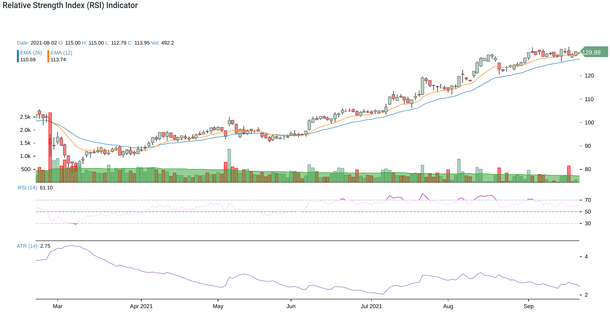

Title: Technical Indicators
Date: 2021-09-23 08:08
Slug: technical indicators
Author: Feng Xia

Technical analysis is mainly based on [react-stockcharts][2]. We
currently support the following indicators: Bollinger Band, Elder Ray,
SAR, Full Stochastics Oscillator, Heikin-Ashi, MACD, and Relative
Strength (RSI). More indicator visuals will be added in future.

## Date range

User can set a date range by using the date picker. Default end date
is TODAY, and start date is 1-month from TODAY. Depending on the
indicator, this default date range may not provide enough data points
for the analysis, thus the first appearance of the chart may look
incomplete. In this case, user should adjust the range to provide more
data points. Graph will refresh automatically when date range is
changed.

**NOTE** that switching between indicators will **reset** the date
range.

<figure class="col s12">
    <figcaption>Stock technical indicator date picker</figcaption>
    
</figure>

## Bollinger Band

See [wiki][3].

<figure class="col s12">
  <figcaption>Example of Bollinger Band</figcaption>
  
</figure>

## Elder Ray

See [intro][4].

<figure class="col s12">
  <figcaption>Example of Elder Ray</figcaption>
  
</figure>

## SAR

See [wiki][5].

<figure class="col s12">
  <figcaption>Example of SAR</figcaption>
  
</figure>

## Full Stochastics Oscillator

See [wiki][6].

<figure class="col s12">
  <figcaption>Example of Full Stochastics oscillator</figcaption>
  
</figure>

## Heikin-Ashi

Read [here][7].

<figure class="col s12">
  <figcaption>Example of Heikin Ashi</figcaption>
  
</figure>

## MACD

See [wiki][8].

<figure class="col s12">
  <figcaption>Example of MACD</figcaption>
  
</figure>

## Relative Strength (RSI)

See [intro][9].

<figure class="col s12">
  <figcaption>Example of RSI</figcaption>
  
</figure>

[2]: https://github.com/rrag/react-stockcharts
[3]: https://en.wikipedia.org/wiki/Bollinger_Bands
[4]: https://www.investopedia.com/terms/e/elderray.asp
[5]: https://en.wikipedia.org/wiki/Parabolic_SAR
[6]: https://en.wikipedia.org/wiki/Stochastic_oscillator
[7]: https://www.investopedia.com/trading/heikin-ashi-better-candlestick/
[8]: https://en.wikipedia.org/wiki/MACD
[9]: https://www.investopedia.com/terms/r/rsi.asp
